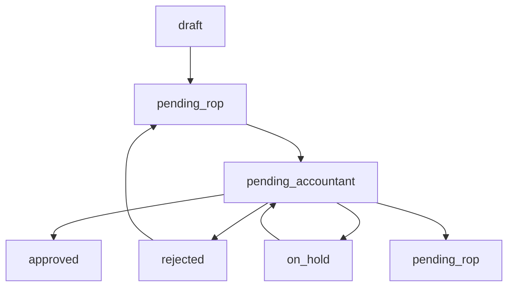

# MDS Doors: Contract Workflow System

## Обзор

Система workflow для управления договорами MDS Doors реализует полный цикл согласования: **Менеджер → РОП → Бухгалтер**.

## Роли и права доступа

### 👤 Менеджер
- **Создание**: Может создавать новые договоры
- **Редактирование**: Только в статусе `draft` или `rejected`
- **Workflow**: Может отправлять договоры на рассмотрение РОП
- **Доступ**: Только свои договоры

### 👨‍💼 РОП (Руководитель отдела продаж)
- **Редактирование**: Договоры в статусе `pending_rop` или `rejected`
- **Workflow**: Может отправлять договоры бухгалтеру
- **Доступ**: Все договоры своего филиала

### 👩‍💼 Бухгалтер
- **Редактирование**: Не может редактировать поля договора
- **Workflow**: Может одобрять, отклонять, приостанавливать, возвращать на доработку
- **Доступ**: Все договоры в статусе `pending_accountant`

### 👑 Администратор
- **Полный доступ**: Может выполнять любые действия
- **Override**: Может разблокировать одобренные договоры

## Статусы договоров

| Статус | Описание | Кто может редактировать |
|--------|----------|-------------------------|
| `draft` | Черновик | Менеджер (создатель) |
| `pending_rop` | На рассмотрении РОП | РОП |
| `pending_accountant` | На рассмотрении бухгалтера | Только бухгалтер (действия) |
| `approved` | Одобрен | Только админ |
| `rejected` | Отклонен | РОП |
| `on_hold` | Приостановлен | Бухгалтер |

## Workflow переходы



### Действия по ролям:

**Менеджер:**
- `draft` → `pending_rop` (Отправить на РОП)

**РОП:**
- `pending_rop` → `pending_accountant` (Отправить бухгалтеру)
- `rejected` → `pending_accountant` (Повторная отправка)

**Бухгалтер:**
- `pending_accountant` → `approved` (Одобрить)
- `pending_accountant` → `rejected` (Отклонить)
- `pending_accountant` → `on_hold` (Приостановить)
- `pending_accountant` → `pending_rop` (Вернуть на доработку)

## Аудит и версионирование

### Отслеживание изменений
- Каждое изменение поля логируется в `contract_changes`
- Автоматическое увеличение версии при изменениях
- Полная история с указанием автора и времени

### Финансовые поля
Следующие поля требуют повторного одобрения при изменении:
- `order_total` (Общая сумма)
- `order_deposit` (Депозит)
- `order_remainder` (Остаток)
- `order_due` (К оплате)
- `payment` (Способ оплаты)

## API Endpoints

### Workflow действия
```
POST /admin/contracts/{contract}/submit-to-rop
POST /admin/contracts/{contract}/submit-to-accountant
POST /admin/contracts/{contract}/approve
POST /admin/contracts/{contract}/reject
POST /admin/contracts/{contract}/hold
POST /admin/contracts/{contract}/return
GET  /admin/contracts/{contract}/history
```

### Ролевые префиксы
- `/admin/` - для администраторов
- `/manager/` - для менеджеров
- `/rop/` - для РОП
- `/accountant/` - для бухгалтеров

## Компоненты UI

### Статус договора
```blade
<x-contract-status :contract="$contract" />
```

### Кнопки действий
```blade
<x-workflow-actions :contract="$contract" />
```

## База данных

### Новые таблицы
- `contract_changes` - аудит изменений полей
- `approvals` - история одобрений

### Новые поля в contracts
- `status` - статус договора
- `version` - версия документа
- `current_reviewer_id` - ID текущего рецензента

## Тестирование

### Тестовые аккаунты
```
Менеджер: manager@test.com / password
РОП: rop@test.com / password
Бухгалтер: accountant@test.com / password
```

### Запуск тестов
```bash
php artisan db:seed --class=WorkflowTestSeeder
```

## Безопасность

### Валидация
- Проверка прав доступа на уровне контроллеров
- Валидация переходов статусов
- Обязательные комментарии для отклонения/приостановки

### Логирование
- Все действия логируются в `storage/logs/laravel.log`
- Аудит изменений в базе данных
- Версионирование документов

## Уведомления

Система поддерживает уведомления (планируется):
- Email уведомления при смене статуса
- In-app уведомления
- Настраиваемые шаблоны

## Настройки

### Конфигурация
- Настройки уведомлений
- Автоматические действия
- Политики безопасности

## Разработка

### Добавление новых статусов
1. Добавить константу в модель `Contract`
2. Обновить миграцию enum
3. Добавить логику в `ContractStateService`
4. Обновить UI компоненты

### Добавление новых действий
1. Добавить метод в `ContractStateService`
2. Создать контроллер action
3. Добавить маршрут
4. Обновить UI компоненты

## Поддержка

При возникновении проблем:
1. Проверить логи: `storage/logs/laravel.log`
2. Проверить права доступа пользователя
3. Убедиться в корректности статуса договора
4. Проверить связи в базе данных
